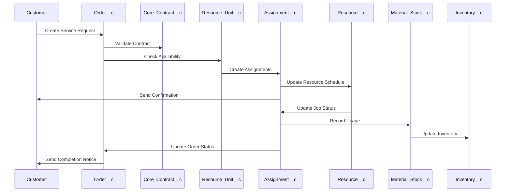
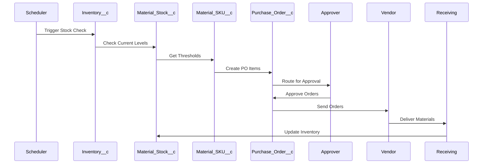

# Data Communication

The BoxFresh App uses a shared data model to enable communication between different components. This document outlines how data is shared and updated across the system.

## 1. Shared Data Store

The primary method of communication in the BoxFresh App is through the Salesforce database. All components read from and write to this central data store, ensuring data consistency and providing a single source of truth.

### Core Data Structure

The shared data store includes:

```
{
  "inventory": {
    "material_skus": [Material_SKU__c records],
    "material_stock": [Material_Stock__c records],
    "inventory_locations": [Inventory__c records]
  },
  "resources": {
    "staff": [Resource__c records],
    "assets": [Resource_Asset__c records],
    "units": [Resource_Unit__c records]
  },
  "services": {
    "contracts": [Core_Contract__c records],
    "orders": [Order__c records],
    "assignments": [Assignment__c records]
  },
  "properties": {
    "properties": [Property__c records],
    "locations": [Service_Location__c records]
  }
}
```

## 2. Component Communication Patterns

### Service Request Processing

1. **Request Intake** reads customer and contract data
2. **Resource Assignment** reads resource availability and writes assignment data
3. **Schedule Creation** reads assignments and writes schedule data
4. **Customer Notification** reads schedule data

### Inventory Management

1. **Stock Check** reads current inventory data
2. **Inventory Update** reads usage data and writes updated inventory data
3. **Reorder Evaluation** reads inventory thresholds and writes reorder recommendations
4. **Reorder Process** reads reorder data and writes purchase orders

### Job Completion

1. **Status Update** reads assignment data and writes status changes
2. **Material Usage** reads job data and writes inventory updates
3. **Performance Analysis** reads job history and writes performance metrics
4. **Billing Preparation** reads job data and writes billing information

## 3. Data Flow Diagrams

### Service Request to Completion Flow



### Inventory Reordering Flow



## 4. Pub/Sub Communication

In addition to the shared data store, the BoxFresh App uses Salesforce Platform Events for real-time communication between components.

### Key Platform Events

1. **Inventory_Changed__e**
   - Published when inventory levels change
   - Subscribers: Inventory dashboard, reordering process

2. **Assignment_Updated__e**
   - Published when job assignments change
   - Subscribers: Resource calendar, customer notification process

3. **Job_Completed__e**
   - Published when a job is marked complete
   - Subscribers: Billing process, customer feedback request

## 5. Integration Points

The BoxFresh App communicates with external systems through defined integration points:

1. **Customer Communication**
   - Email templates for customer notifications
   - SMS notifications for job reminders

2. **Vendor Integration**
   - API endpoints for automated purchase orders
   - Webhook receivers for delivery confirmations

3. **Mobile App Integration**
   - API endpoints for field staff mobile application
   - Real-time synchronization of job data 