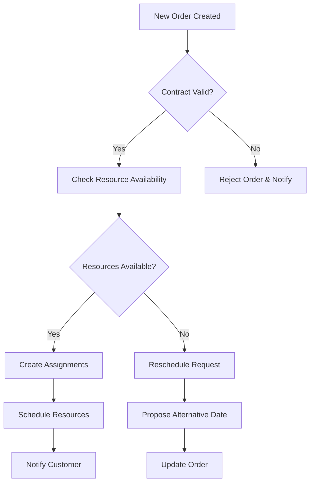
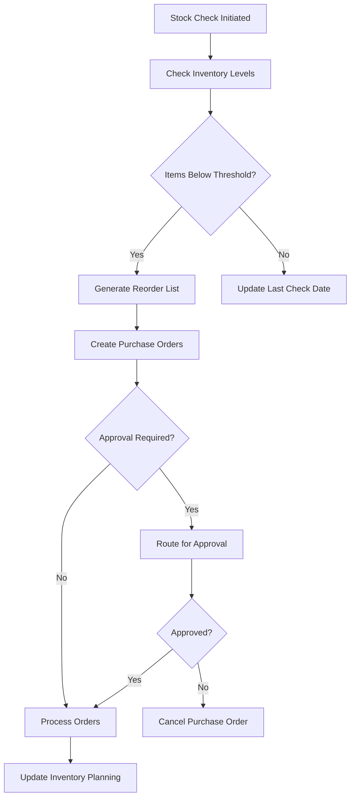
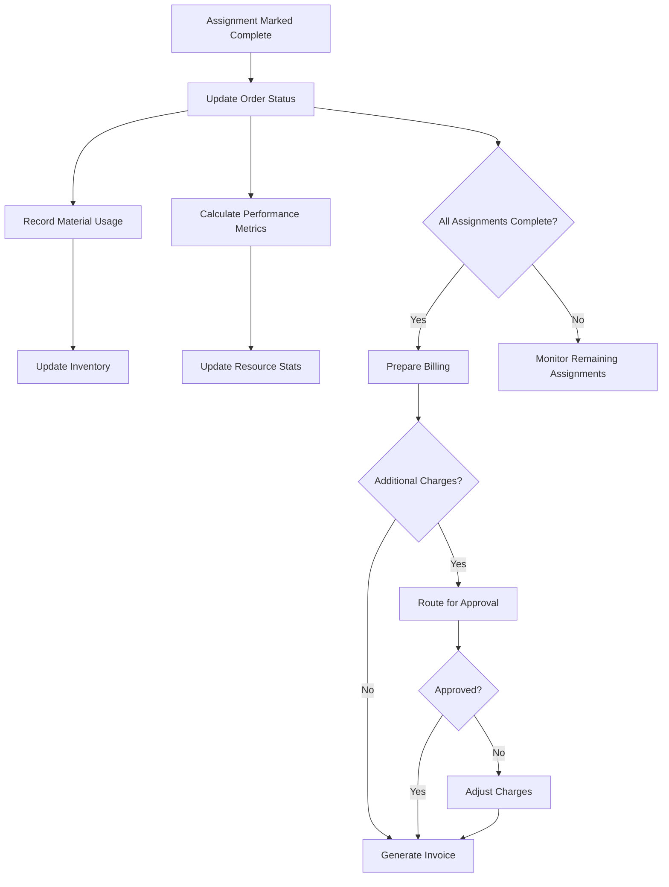
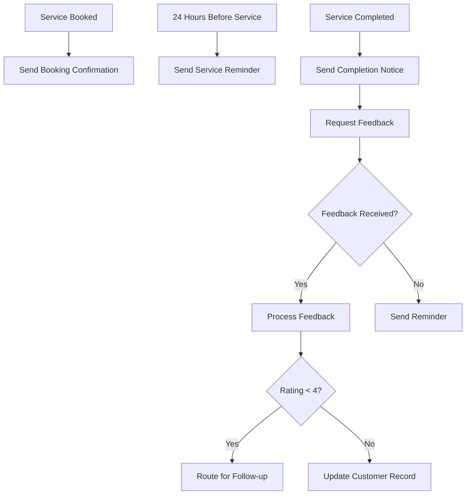

# Process Flows

The BoxFresh App uses Salesforce Flows to automate business processes. These flows connect the different objects in the system to enable efficient service delivery and resource management.

## 1. Service Request Flow

This flow manages the process of receiving and fulfilling service requests.

  

### Process Steps:

1. **Request Intake**
   - Triggered when a new Order__c record is created
   - Validates the request details
   - Creates related records as needed

2. **Resource Assignment**
   - Determines available Resource_Unit__c records
   - Creates Assignment__c records
   - Updates resource availability

3. **Schedule Creation**
   - Organizes assignments into an efficient schedule
   - Updates Order__c with schedule details

4. **Customer Notification**
   - Sends confirmation to the customer
   - Provides schedule details and service information

### Flow Diagram:

## 2. Inventory Management Flow

This flow manages the inventory tracking and reordering process.

### Process Steps:

1. **Stock Check**
   - Triggered by a scheduled job or manual request
   - Checks current inventory levels

2. **Inventory Update**
   - Updates inventory levels based on recent usage
   - Calculates remaining capacity

3. **Reorder Evaluation**
   - Determines if reordering is needed
   - Identifies items below threshold

4. **Reorder Process**
   - Creates purchase orders for required items
   - Routes for approval if needed

### Flow Diagram:

## 3. Job Completion Flow

This flow manages the process of completing service jobs and related follow-up actions.

### Process Steps:

1. **Status Update**
   - Triggered when an Assignment__c status is updated to 'Completed'
   - Updates related Order__c status

2. **Material Usage**
   - Records materials used during the job
   - Updates inventory levels

3. **Performance Analysis**
   - Calculates performance metrics
   - Updates resource statistics

4. **Billing Preparation**
   - Prepares billing information
   - Routes for approval if needed

### Flow Diagram:

## 4. Customer Communication Flow

This flow manages communications with customers throughout the service lifecycle.

### Process Steps:

1. **Initial Confirmation**
   - Sends confirmation of service booking
   - Provides service details and instructions

2. **Reminder Notifications**
   - Sends reminders before scheduled service
   - Provides opportunity to reschedule if needed

3. **Completion Notification**
   - Notifies when service is completed
   - Provides summary of work performed

4. **Feedback Request**
   - Requests customer feedback
   - Routes feedback for review

### Flow Diagram:

