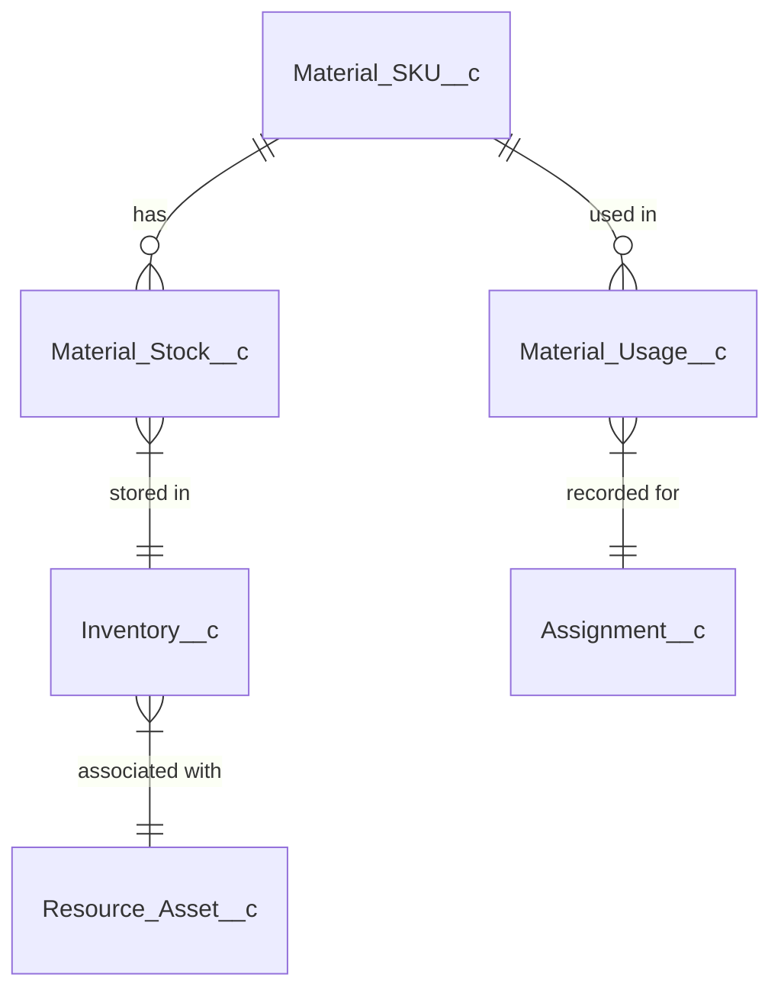

# Structured Data Model

The BoxFresh App follows a structured data model design pattern to ensure consistent, reliable data organization throughout the application.

## Core Design Principles

### 1. Object Hierarchy

The data model is organized into a clear hierarchy with well-defined parent-child relationships:

- **Account** (standard) is the top-level parent for all customer-related objects
- **Core_Contract__c** acts as a central hub for service agreements
- **Resource_Unit__c** serves as a container for resource assignments

This hierarchical design allows for efficient data access and maintains relational integrity.

### 2. Modular Components

The data model is broken down into modular components that represent distinct business entities:

- **Inventory Module**: Material SKUs, stock levels, and storage locations
- **Resource Module**: Staff, equipment, and resource units
- **Service Module**: Contracts, orders, and assignments

Each module can be extended or modified independently without affecting the entire system.

### 3. Normalized Structure

The data model follows database normalization principles to reduce redundancy and improve data integrity:

- Data is stored in its most atomic form
- Lookup relationships connect related records
- Junction objects handle many-to-many relationships

## Implementation Example

### Material Inventory Structure

The material inventory structure demonstrates these principles in action:



#### Material_SKU__c

The catalog of unique materials that can be stocked.

**Key Fields:**
- `Name`: Unique identifier (SKU)
- `Description__c`: Detailed description
- `Unit_of_Measure__c`: How the material is measured
- `Unit_Cost__c`: Cost per unit

#### Material_Stock__c

Represents actual quantities of materials in inventory.

**Key Fields:**
- `Material_SKU__c`: Reference to the material definition
- `Quantity__c`: Amount in stock
- `Purchase_Date__c`: When the stock was acquired
- `Inventory__c`: Where the stock is located

#### Inventory__c

Represents a physical storage location.

**Key Fields:**
- `Name`: Location identifier
- `Capacity__c`: Maximum storage capacity
- `Resource_Asset__c`: Associated vehicle or container

This structure allows:
- Material definitions to be separated from physical inventory
- Stock levels to be tracked by location
- Usage to be recorded against specific jobs

## YAML Data Representation

The structured data model enables consistent data representation in YAML format for API interactions and data exports:

```yaml
material_sku:
  id: "a0123456789abcde"
  name: "Premium Compost"
  description: "High-quality organic compost"
  unit_of_measure: "kg"
  unit_cost: 2.50
  category: "Soil & Amendments"
  
material_stock:
  - id: "a0123456789abcdf"
    material_sku_id: "a0123456789abcde"
    quantity: 500
    purchase_date: "2023-04-15"
    expiration_date: "2024-04-15"
    inventory_id: "a0123456789abcdg"
    
  - id: "a0123456789abcdh"
    material_sku_id: "a0123456789abcde"
    quantity: 250
    purchase_date: "2023-05-20"
    expiration_date: "2024-05-20"
    inventory_id: "a0123456789abcdi"
```

## Benefits of the Structured Model

1. **Scalability**: The modular design allows the system to scale as the business grows
2. **Maintainability**: Clear separation of concerns makes updates and enhancements easier
3. **Data Integrity**: Normalized structure helps prevent inconsistencies
4. **Reporting**: Well-structured data enables powerful reporting and analytics
5. **Integration**: The structured model makes integration with external systems more straightforward

## Validation Rules

The BoxFresh App includes validation rules to enforce the structured data model:

### Material_Stock__c Validation

```apex
// Ensure stock quantity is positive
Quantity__c > 0

// Ensure expiration date is after purchase date
Expiration_Date__c > Purchase_Date__c
```

### Inventory__c Validation

```apex
// Ensure capacity is positive
Capacity__c > 0

// Ensure resource asset has storage capability
Resource_Asset__r.Has_Storage__c = true
```

### Assignment__c Validation

```apex
// Ensure end time is after start time
End_Time__c > Start_Time__c

// Ensure resource unit has capacity
Resource_Unit__r.Capacity__c > (SELECT COUNT() FROM Assignments__r 
                               WHERE Start_Time__c.date() = THIS.Start_Time__c.date())
```

These validation rules help maintain data integrity and ensure the structured model works correctly in all scenarios. 