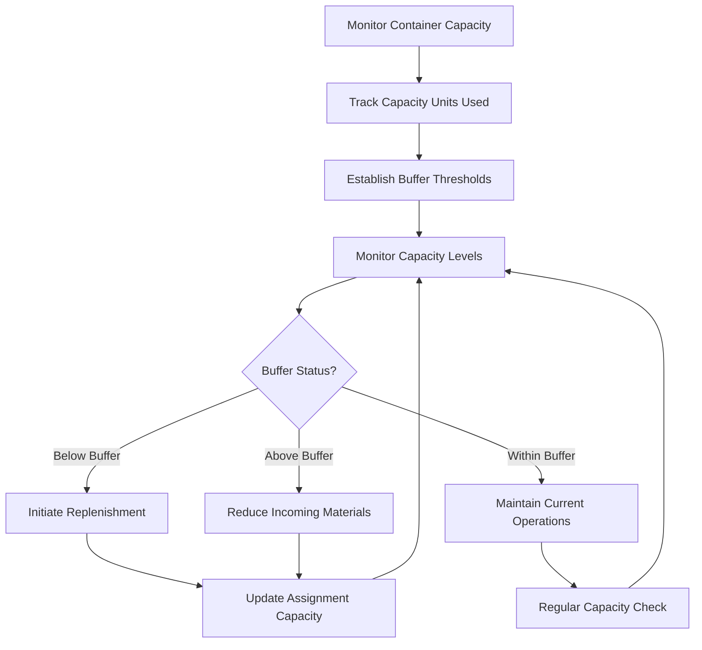

# Workflow Automation

The BoxFresh App uses workflow automation to streamline business processes, reduce manual effort, and ensure consistent handling of data across garden maintenance operations, with a focus on implementing Eliyahu Goldratt's Theory of Constraints principles.

## Core Automation Components

### 1. Record-Triggered Flows

These flows run automatically when records are created, updated, or deleted. Key examples include:

- **New Order Flow**: Triggers when a new Order__c record is created, automatically generating Assignment__c junction records to connect contracts with inventory and resources
- **Job Completion Flow**: Triggers when an Assignment__c status changes to 'Completed', updating inventory capacity, recording material usage, and preparing billing records
- **Inventory Threshold Flow**: Triggers when Material_Stock__c quantity crosses defined capacity thresholds, maintaining optimal inventory levels
- **Capacity Alert Flow**: Triggers when container capacity reaches critical thresholds (above 70% or below 30%)

### 2. Scheduled Flows

These flows run on a predetermined schedule, handling routine tasks without manual intervention:

- **Daily Schedule Generation**: Runs each evening to create the next day's schedules, optimizing resource allocation based on identified constraints
- **Weekly Inventory Management**: Runs every Sunday to assess inventory levels against optimal capacity thresholds
- **Monthly Throughput Analysis**: Runs on the 1st of each month to identify system constraints and improvement opportunities
- **Capacity Planning Flow**: Runs weekly to align inventory with upcoming scheduled demand

### 3. User-Invoked Flows

These flows are manually initiated by users through buttons or actions:

- **Material Usage Recorder**: Launched from an Assignment__c record to log materials used during service delivery
- **Schedule Optimizer**: Launched from a Resource_Unit__c record to rearrange assignments and maximize throughput
- **Resource Allocation Adjuster**: Launched from a Resource_Asset__c record to reallocate based on identified bottlenecks
- **Buffer Management Tool**: Launched from Material_Stock__c to adjust inventory buffers based on demand fluctuations

## Implementation Example

### Container Capacity Management Flow

This flow demonstrates the workflow automation pattern for treating inventory as a controlled capacity system:



#### Implementation:

```apex
// Trigger for Inventory Container Capacity Management
trigger ContainerCapacityMonitor on Inventory__c (after update) {
    List<Id> capacityAlertIds = new List<Id>();
    
    for (Inventory__c container : Trigger.new) {
        Inventory__c oldContainer = Trigger.oldMap.get(container.Id);
        
        // Calculate available capacity percentage
        Decimal availablePercentage = 100 * container.Available_Units__c / container.Capacity_Units__c;
        
        // Check if crossing buffer thresholds
        if ((availablePercentage <= 30 && oldContainer.Available_Units__c / oldContainer.Capacity_Units__c > 0.3) || 
            (availablePercentage >= 70 && oldContainer.Available_Units__c / oldContainer.Capacity_Units__c < 0.7)) {
            capacityAlertIds.add(container.Id);
        }
    }
    
    if (!capacityAlertIds.isEmpty()) {
        // Process capacity alerts and adjust buffer status
        CapacityManager.processBufferAlerts(capacityAlertIds);
    }
}
```

The flow then:
1. Monitors capacity utilization across all containers
2. Identifies any capacity constraints in inventory management
3. Manages buffer levels to ensure optimal throughput
4. Adjusts material allocation based on capacity constraints
5. Maintains inventory as a controlled-capacity system rather than an unlimited storage resource

### Assignment Junction Flow

When a new Assignment is created, this flow establishes the critical junction relationship between contracts, inventory containers, and resources:

```apex
// Processor class for Assignment creation
public class AssignmentJunctionProcessor {
    public static void processNewAssignments(List<Id> newAssignmentIds) {
        // Load the new assignments
        List<Assignment__c> newAssignments = [
            SELECT Id, Core_Contract__c, Resource_Unit__c, 
                   Total_Capacity_Required__c, Assigned_Inventory__c
            FROM Assignment__c 
            WHERE Id IN :newAssignmentIds
        ];
        
        Map<Id, List<Assignment__c>> contractAssignments = new Map<Id, List<Assignment__c>>();
        
        // Group assignments by contract
        for (Assignment__c assignment : newAssignments) {
            if (!contractAssignments.containsKey(assignment.Core_Contract__c)) {
                contractAssignments.put(assignment.Core_Contract__c, new List<Assignment__c>());
            }
            contractAssignments.get(assignment.Core_Contract__c).add(assignment);
        }
        
        // For each contract, find available inventory containers
        for (Id contractId : contractAssignments.keySet()) {
            CapacityManager.allocateInventoryToAssignments(
                contractAssignments.get(contractId)
            );
        }
    }
}
```

## Benefits of Constraint-Based Workflow Automation

1. **Optimized Throughput**: Focuses on identifying and managing system constraints to maximize flow
2. **Controlled Inventory**: Treats inventory as a capacity-limited resource rather than an unlimited asset
3. **Bottleneck Management**: Dynamically identifies and addresses bottlenecks in the service delivery process
4. **Buffer Protection**: Establishes and manages capacity buffers to protect system throughput
5. **Continuous Improvement**: Implements the five focusing steps of TOC for ongoing system optimization

## Implementation Patterns

The BoxFresh App uses different implementation approaches based on the Theory of Constraints principles:

### Flow Builder Patterns

Used for:
- **Capacity monitoring**: Tracking container capacity utilization
- **Buffer management**: Monitoring and adjusting capacity buffers
- **Throughput accounting**: Tracking and reporting on system throughput metrics
- **Constraint identification**: Identifying and categorizing system constraints

### Apex Patterns

Used for:
- **Capacity calculations**: Maintaining precise counts of inventory capacity utilization
- **Assignment junction logic**: Managing the relationships between contracts, inventory, and resources
- **Constraint analysis**: Analyzing data to identify shifting constraints in the system
- **Buffer adjustment algorithms**: Dynamically adjusting buffer sizes based on usage patterns

## Performance Considerations

Constraint-based workflow automation is designed with performance in mind:

1. **Focus on the Bottleneck**: Processing resources are concentrated on managing the system constraint
2. **Subordination**: Non-constraint processes are designed to support the constraint's needs
3. **Batch Optimization**: Batch sizes are optimized based on constraint capacity, not arbitrary schedules
4. **Buffer Management**: Capacity buffers are carefully sized to protect throughput without excess

## Monitoring and Maintenance

Workflow automation is monitored and maintained through:

1. **Constraint Dashboards**: Visual tracking of current system constraints and buffer status
2. **Throughput Metrics**: Regular tracking of system throughput and operating expense
3. **Buffer Penetration Alerts**: Notifications when buffers are at risk of depletion
4. **Constraint Shift Detection**: Automated identification when system constraints move to different areas

## Example: Inventory Capacity Management Workflow

```yaml
workflow:
  name: "Container Capacity Management Process"
  trigger: "Inventory__c.Available_Units__c changes OR crosses buffer thresholds"
  steps:
    - evaluate_container_capacity:
        action: "Calculate current capacity utilization across all containers"
        output: "Current buffer status"
    
    - check_assignment_requirements:
        action: "Check capacity demands of current assignments"
        output: "Required capacity units"
    
    - update_buffer_status:
        action: "Update buffer status indicator on container records"
        output: "Updated buffer zone indicators"
    
    - generate_alerts:
        action: "Create alerts for containers crossing buffer thresholds"
        condition: "Buffer threshold crossed"
    
    - update_assignment_capacity:
        action: "Update Assignment__c.Capacity_Allocated__c for each container"
```

This workflow ensures inventory capacity is managed as a constraint, implementing Eliyahu Goldratt's Theory of Constraints principles to optimize throughput and reduce excess inventory while preventing shortages. 