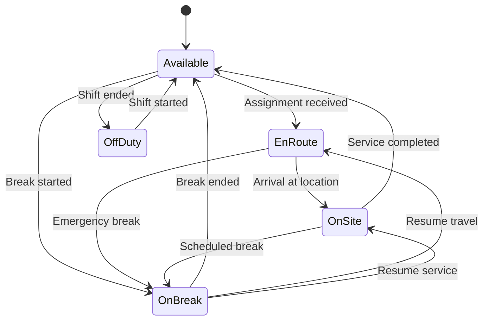

# Field Agent System

The Field Agent System in the BoxFresh App manages technicians as autonomous agents, optimizing service delivery through intelligent routing, real-time tracking, and mobile integration.

## Agent Structure

Each technician is modeled as an autonomous agent with specific attributes:

- **Skills and Certifications**: Specialized abilities (e.g., irrigation, landscape design, chemical application)
- **Equipment Access**: Tools and machinery accessible to the technician
- **Geographic Zones**: Primary and secondary service areas, with travel radius constraints
- **Time Availability**: Work schedule including shifts, breaks, and time-off

**Agent Object Structure**:

```yaml
technician:
  id: "T-10045"
  name: "Alex Rivera"
  skills:
    - "Irrigation Installation": 5  # Skill level 1-5
    - "Lawn Care": 4
    - "Plant Disease Treatment": 3
  certification:
    - "Certified Landscape Technician"
    - "Chemical Applicator License"
  equipment_access:
    - "Vehicle-1045"  # Company truck
    - "Sprayer-XL2"   # Equipment
    - "Mower-M200"    # Equipment
  geographic_zones:
    primary: "Northwest Sector"
    secondary: ["Central Sector", "Northeast Sector"]
    travel_radius: 25  # miles
  availability:
    schedule: "Monday-Friday"
    shift: "8:00-16:30"
    breaks:
      - "12:00-12:30"
    time_off:
      - "2025-05-20" to "2025-05-24"  # Vacation
```

## Agent States

Technicians operate in defined states during operations:

1. **Available**: Ready for assignment to new service calls
2. **En Route**: Traveling to service location
3. **On Site**: Performing service at customer location
4. **On Break**: Temporarily unavailable (lunch, rest period)
5. **Off Duty**: Not currently working

The system tracks state transitions to maintain accurate operational awareness:



## Intelligent Routing

### Location-Based Assignment

The system assigns services based on technician proximity and zone alignment:

```apex
public List<Assignment__c> findOptimalAssignments(Date serviceDate, List<Id> availableTechIds) {
    // Get all unassigned service requests for the date
    List<Service_Request__c> requests = [
        SELECT Id, Service_Location__c, Customer__c, Service_Type__c,
               Skill_Requirements__c, Location__Latitude__s, Location__Longitude__s
        FROM Service_Request__c
        WHERE Status__c = 'Unassigned'
        AND Requested_Date__c = :serviceDate
    ];
    
    // Get technician locations and skills
    List<Technician__c> techs = [
        SELECT Id, Current_Location__Latitude__s, Current_Location__Longitude__s,
               Skills__c, Primary_Zone__c, Secondary_Zones__c
        FROM Technician__c
        WHERE Id IN :availableTechIds
    ];
    
    // Match technicians to service requests based on location and skills
    Map<Id, Id> requestToTechMap = RoutingEngine.calculateOptimalAssignments(requests, techs);
    
    // Create assignments
    List<Assignment__c> newAssignments = new List<Assignment__c>();
    for (Id requestId : requestToTechMap.keySet()) {
        newAssignments.add(new Assignment__c(
            Service_Request__c = requestId,
            Technician__c = requestToTechMap.get(requestId),
            Status__c = 'Assigned'
        ));
    }
    
    return newAssignments;
}
```

### Skill-Based Matching

Services requiring specific skills are matched to appropriately qualified technicians:

```apex
public class SkillMatcher {
    public static Map<String, Integer> parseSkillRequirements(String skillRequirementsJson) {
        return (Map<String, Integer>) JSON.deserialize(skillRequirementsJson, Map<String, Integer>.class);
    }
    
    public static Boolean meetsRequirements(Map<String, Integer> requirements, Map<String, Integer> techSkills) {
        for (String skill : requirements.keySet()) {
            Integer requiredLevel = requirements.get(skill);
            Integer techLevel = techSkills.containsKey(skill) ? techSkills.get(skill) : 0;
            
            if (techLevel < requiredLevel) {
                return false;
            }
        }
        return true;
    }
}
```

## Real-Time Operations

### Location Tracking

The system continually updates technician locations for accurate routing and customer notifications:

```apex
public class LocationTracker {
    @AuraEnabled
    public static void updateTechnicianLocation(Id techId, Decimal latitude, Decimal longitude) {
        Technician__c tech = new Technician__c(
            Id = techId,
            Current_Location__Latitude__s = latitude,
            Current_Location__Longitude__s = longitude,
            Last_Location_Update__c = Datetime.now()
        );
        
        update tech;
        
        // Find active assignments to update ETA
        List<Assignment__c> activeAssignments = [
            SELECT Id, Customer__c, Service_Location__Latitude__s, Service_Location__Longitude__s
            FROM Assignment__c
            WHERE Technician__c = :techId
            AND Status__c = 'En Route'
        ];
        
        if (!activeAssignments.isEmpty()) {
            updateCustomerETA(activeAssignments[0], latitude, longitude);
        }
    }
    
    private static void updateCustomerETA(Assignment__c assignment, Decimal techLat, Decimal techLong) {
        // Calculate distance and ETA
        Decimal distance = calculateDistance(
            techLat, techLong,
            assignment.Service_Location__Latitude__s,
            assignment.Service_Location__Longitude__s
        );
        
        Integer etaMinutes = calculateETA(distance);
        
        // Update assignment
        assignment.Estimated_Arrival_Time__c = Datetime.now().addMinutes(etaMinutes);
        update assignment;
        
        // Notify customer if ETA changed significantly
        notifyCustomerIfNeeded(assignment);
    }
}
```

### Assignment Status Updates

Technicians update assignment status through the mobile interface to maintain real-time service visibility:

```apex
public class AssignmentStatusManager {
    @AuraEnabled
    public static void updateAssignmentStatus(Id assignmentId, String newStatus, String notes) {
        Assignment__c assignment = new Assignment__c(
            Id = assignmentId,
            Status__c = newStatus,
            Last_Status_Update__c = Datetime.now(),
            Technician_Notes__c = notes
        );
        
        update assignment;
        
        // Update technician state based on assignment status
        updateTechnicianState(assignment);
        
        // Trigger appropriate notifications
        if (newStatus == 'En Route') {
            notifyCustomerOfDeparture(assignmentId);
        } else if (newStatus == 'On Site') {
            notifyCustomerOfArrival(assignmentId);
        } else if (newStatus == 'Completed') {
            processServiceCompletion(assignmentId);
        }
    }
}
```

## Decision Automation

### Rescheduling

The system automatically suggests rescheduling when service constraints are identified:

```apex
public class ServiceRescheduler {
    public static void evaluateForRescheduling(List<Assignment__c> assignments) {
        List<Assignment__c> toReschedule = new List<Assignment__c>();
        
        for (Assignment__c assignment : assignments) {
            // Check if technician will have difficulty completing on time
            if (isAtRiskOfDelay(assignment)) {
                // Find next available slot
                DateTime nextSlot = findNextAvailableSlot(assignment.Technician__c, 
                                                          assignment.Estimated_Duration__c);
                
                assignment.Scheduled_DateTime__c = nextSlot;
                assignment.Is_Rescheduled__c = true;
                assignment.Reschedule_Reason__c = 'System optimization - service delay risk';
                
                toReschedule.add(assignment);
            }
        }
        
        if (!toReschedule.isEmpty()) {
            update toReschedule;
            notifyCustomersOfReschedule(toReschedule);
        }
    }
}
```

### Service Prioritization

Assignments are prioritized based on factors such as customer tier, service criticality, and time constraints:

```yaml
prioritization_rules:
  - rule: "Emergency Services"
    conditions:
      service_type: "Emergency Repair"
    priority: 1
    explanation: "Emergency services take absolute priority"
    
  - rule: "Premium Customer Service"
    conditions:
      account_tier: "Platinum"
      days_since_last_service: ">14"
    priority: 2
    explanation: "Platinum customers waiting 2+ weeks receive priority"
    
  - rule: "Weather Risk Services"
    conditions:
      service_type: "Garden Maintenance"
      weather_risk: "High"
    priority: 3
    explanation: "Services affected by impending weather are prioritized"
    
  - rule: "Schedule Optimization"
    conditions:
      travel_distance: "<5 miles"
      from_previous_job: true
    priority: 4
    explanation: "Nearby services are grouped for efficiency"
```

## Mobile Agent Interface

The technician mobile app provides core functionality for field operations:

### Daily Schedule View

Displays an organized list of assignments with critical details:

```yaml
schedule_view:
  - assignment:
      id: "A-5789"
      customer: "Johnson Residence"
      service_type: "Garden Maintenance"
      address: "123 Maple Street, Springfield"
      scheduled_time: "09:00-10:30"
      priority: "Standard"
      travel_time: "15 min"
      
  - assignment:
      id: "A-5790"
      customer: "Riverdale Community Center"
      service_type: "Irrigation Repair"
      address: "45 Riverdale Road, Springfield"
      scheduled_time: "11:00-12:30"
      priority: "High"
      travel_time: "20 min"
```

### Navigation Integration

Provides turn-by-turn directions to service locations using device navigation:

```apex
@AuraEnabled
public static String getNavigationLink(Id assignmentId) {
    Assignment__c assignment = [
        SELECT Service_Location__Latitude__s, Service_Location__Longitude__s,
               Service_Location__Street__c, Service_Location__City__c,
               Service_Location__State__c, Service_Location__PostalCode__c
        FROM Assignment__c
        WHERE Id = :assignmentId
        LIMIT 1
    ];
    
    // Create deep links for various navigation apps
    String googleMapsUrl = 'https://maps.google.com/?daddr=' + 
                          assignment.Service_Location__Latitude__s + ',' + 
                          assignment.Service_Location__Longitude__s;
                          
    return googleMapsUrl;
}
```

### Service Protocols

Provides step-by-step guidance for each service type:

```yaml
service_protocol:
  type: "Irrigation System Inspection"
  steps:
    - order: 1
      action: "Visual inspection of all sprinkler heads"
      guidance: "Check for physical damage, misalignment, or obstruction"
      
    - order: 2
      action: "Run each zone for 2 minutes"
      guidance: "Observe spray patterns and coverage, note any dry spots"
      photo_required: true
      
    - order: 3
      action: "Inspect control box and wiring"
      guidance: "Check for corrosion, loose connections, or damaged wiring"
      
    - order: 4
      action: "Test rain sensor if present"
      guidance: "Apply water to sensor and confirm system shutdown"
      
    - order: 5
      action: "Document findings"
      guidance: "Take photos of any issues and note in service report"
      photo_required: true
      
  materials:
    - name: "Replacement sprinkler heads"
      recommended_quantity: 3
      
    - name: "Wire connectors"
      recommended_quantity: 10
      
  estimated_duration: "45 minutes"
```

### Inventory Management

Tracks material usage during service delivery:

```apex
@AuraEnabled
public static void recordMaterialUsage(Id assignmentId, String materialsJson) {
    List<Material_Usage__c> usages = new List<Material_Usage__c>();
    List<Map<String, Object>> materials = (List<Map<String, Object>>) JSON.deserializeUntyped(materialsJson);
    
    for (Map<String, Object> material : materials) {
        usages.add(new Material_Usage__c(
            Assignment__c = assignmentId,
            Material__c = (Id)material.get('materialId'),
            Quantity_Used__c = (Decimal)material.get('quantity'),
            Usage_Notes__c = (String)material.get('notes')
        ));
    }
    
    insert usages;
    
    // Update inventory stock levels
    updateInventoryLevels(materialsJson);
}
```

### Data Synchronization

Ensures reliable operation in areas with intermittent connectivity:

```apex
@AuraEnabled
public static void syncOfflineData(String offlineDataJson) {
    Map<String, Object> offlineData = (Map<String, Object>) JSON.deserializeUntyped(offlineDataJson);
    
    // Process assignments
    if (offlineData.containsKey('assignments')) {
        processOfflineAssignments((List<Map<String, Object>>)offlineData.get('assignments'));
    }
    
    // Process material usage
    if (offlineData.containsKey('materialUsage')) {
        processOfflineMaterialUsage((List<Map<String, Object>>)offlineData.get('materialUsage'));
    }
    
    // Process photos
    if (offlineData.containsKey('photos')) {
        processOfflinePhotos((List<Map<String, Object>>)offlineData.get('photos'));
    }
    
    // Process location history
    if (offlineData.containsKey('locationHistory')) {
        processOfflineLocationHistory((List<Map<String, Object>>)offlineData.get('locationHistory'));
    }
}
```

## Benefits

The Field Agent System delivers significant operational advantages:

1. **Optimized Service Delivery**: Intelligent routing and skill matching ensure efficient service execution.
2. **Improved Customer Experience**: Real-time updates and accurate ETAs enhance communication and trust.
3. **Balanced Workloads**: Automated assignment prevents technician overloading and burnout.
4. **Adaptability**: Dynamic rescheduling responds to changing conditions and constraints.
5. **Data-Driven Improvements**: Real-time field data enables continuous process refinement.

## Agent Performance Metrics

Performance is monitored through key metrics:

| Metric | Description | Target | Calculation |
|--------|-------------|--------|-------------|
| On-Time Arrival Rate | Percentage of services where technician arrived within the scheduled window | >90% | `Services with on-time arrival / Total services` |
| Service Completion Time | Average time to complete services by type | Varies by service | `Sum of service durations / Number of services` |
| Customer Satisfaction | Average rating from post-service customer surveys | >4.5/5 | `Sum of ratings / Number of surveys` |
| Service Efficiency | Ratio of actual service time to estimated time | <1.1 | `Actual service time / Estimated service time` |
| Material Usage Accuracy | Percentage match between estimated and actual materials used | >85% | `Materials used / Materials estimated` |

## Documentation Consolidation

*This document was migrated as part of the Documentation Consolidation Initiative (April 3-11, 2025) from the original `design_pattern/agent.md` file.* 