# Customer Communication System

The BoxFresh App implements a comprehensive customer communication system to ensure clients remain informed throughout the service lifecycle, building transparency and trust.

## Communication Channels

### Email Communications

Email is used for detailed communications and formal notifications:

- **Service Confirmations**: Sent upon scheduling, containing service details, technician information, and preparation instructions.
- **Invoices and Statements**: Sent upon service completion with usage details and billing information.
- **Customer Reports**: Monthly or quarterly service summaries with analytics and recommendations.

**Example Email Template Retrieval**:

```apex
public EmailTemplate getServiceConfirmationTemplate(String serviceType) {
    // Retrieve appropriate template based on service type
    return [
        SELECT Id, Subject, HtmlValue, Body 
        FROM EmailTemplate 
        WHERE DeveloperName = :('Service_Confirmation_' + serviceType)
        LIMIT 1
    ];
}
```

### SMS Communications

SMS is used for immediate, time-sensitive communications:

- **Appointment Reminders**: Sent 24 hours before scheduled service.
- **Technician Arrival Notifications**: Sent when technician is en route.
- **Completion Notifications**: Sent when service is completed.

**Example SMS Dispatch**:

```apex
public void sendServiceReminder(Id assignmentId) {
    Assignment__c assignment = [
        SELECT Id, Customer__r.Phone, Scheduled_Date__c, 
               Scheduled_Time__c, Service_Type__c
        FROM Assignment__c
        WHERE Id = :assignmentId
        LIMIT 1
    ];
    
    String message = 'BoxFresh reminder: Your ' + 
                     assignment.Service_Type__c + 
                     ' service is scheduled for tomorrow at ' + 
                     assignment.Scheduled_Time__c.format('h:mm a') + 
                     '. Reply YES to confirm.';
    
    SmsService.sendMessage(assignment.Customer__r.Phone, message);
}
```

### Customer Portal

The portal provides on-demand access to service information:

- **Upcoming Services**: Calendar view of scheduled maintenance.
- **Service History**: Detailed logs of past services with results and photos.
- **Communication Preferences**: Self-service management of communication channels and frequency.

## Communication Triggers

### Service Lifecycle Triggers

Automated communications are triggered by key events in the service lifecycle:

```mermaid
flowchart LR
    A[Order Created] -->|Confirmation Email| B[Service Scheduled]
    B -->|24h Before| C[Day Before Service]
    C -->|SMS Reminder| D[Service Confirmed]
    D -->|Technician En Route| E[Day of Service]
    E -->|SMS Notification| F[Service in Progress]
    F -->|Service Complete| G[Service Completed]
    G -->|Email Report & Invoice| H[Billing & Feedback]
```



#### Order Creation
- **Trigger**: New Order__c record created
- **Communication**: Confirmation email with estimated service date range
- **Template**: Order_Confirmation_Email

#### Service Scheduling
- **Trigger**: Assignment__c record created with specific date/time
- **Communication**: Detailed service confirmation email
- **Template**: Service_Confirmation_Email

#### Day Before Service
- **Trigger**: Scheduled Assignment__c for tomorrow
- **Communication**: SMS reminder with confirmation request
- **Template**: Day_Before_SMS_Reminder

#### Day of Service
- **Trigger**: Technician status update to "En Route"
- **Communication**: SMS notification with estimated arrival time
- **Template**: En_Route_SMS_Notification

#### Service Completion
- **Trigger**: Assignment__c status changed to "Completed"
- **Communication**: Service summary email with invoice and photos
- **Template**: Service_Completion_Email

## Template Management

### Email Templates

Structured email templates ensure consistent messaging across all customer communications:

```yaml
template:
  name: "Service_Confirmation_Garden"
  subject: "Your Upcoming Garden Service Confirmation"
  body: |
    <h2>Your BoxFresh Garden Service is Confirmed</h2>
    <p>Dear {!Customer__c.Name},</p>
    <p>We're writing to confirm your upcoming garden service:</p>
    <ul>
      <li><strong>Date:</strong> {!Assignment__c.Scheduled_Date__c}</li>
      <li><strong>Time:</strong> {!Assignment__c.Scheduled_Time__c}</li>
      <li><strong>Service Type:</strong> {!Assignment__c.Service_Type__c}</li>
      <li><strong>Technician:</strong> {!Assignment__c.Technician__r.Name}</li>
    </ul>
    <p>Please ensure garden access is available. Your technician will:</p>
    <ul>
      <li>Perform {!Contract__c.Service_Description__c}</li>
      <li>Use approximately {!Assignment__c.Estimated_Material_Usage__c} of materials</li>
      <li>Require approximately {!Assignment__c.Estimated_Duration__c} to complete</li>
    </ul>
    <p>To reschedule, please contact us at least 24 hours in advance.</p>
```

### SMS Templates

Concise SMS templates deliver immediate information while respecting character limits:

```yaml
template:
  name: "En_Route_SMS"
  body: "BoxFresh: Your technician {TECH_NAME} is on the way! Estimated arrival: {ETA}. Track: {TRACKING_LINK}"
```

## Personalization

### Customer Preferences

Communications are tailored based on stored customer preferences:

- **Preferred Channels**: Email, SMS, portal notifications, or combination.
- **Communication Frequency**: Standard, minimal, or detailed communication levels.
- **Language Preference**: Primary language for all communications.

**Example Preference Check**:

```apex
public List<String> getCustomerChannels(Id customerId) {
    Customer__c customer = [
        SELECT Id, Preferred_Communication__c
        FROM Customer__c
        WHERE Id = :customerId
        LIMIT 1
    ];
    
    // Convert multi-select picklist to list
    return customer.Preferred_Communication__c.split(';');
}
```

### Service History Integration

Communications incorporate service history for context:

- **Service Anniversary**: Noting service milestones and historical improvements.
- **Material Usage Trends**: Highlighting efficiency gains or seasonal patterns.
- **Persistent Issues**: Acknowledging ongoing focus areas from previous services.

## Feedback Loop

### Automated Surveys

Post-service surveys collect structured feedback:

- **Satisfaction Rating**: 1-5 scale for overall satisfaction.
- **Technician Rating**: Evaluation of technician performance.
- **Service Quality**: Assessment of service results.
- **Open Comments**: Free-text field for detailed feedback.

### Feedback Integration

Customer feedback is systematically integrated into operations:

- **Immediate Alerts**: Critical feedback triggers immediate review.
- **Trend Analysis**: Recurring themes in feedback drive process improvements.
- **Service Adjustments**: Individual preferences noted from feedback are applied to future services.

```apex
public void processFeedbackResponse(Id surveyResponseId) {
    Survey_Response__c response = [
        SELECT Id, Customer__c, Assignment__c, Satisfaction_Rating__c, 
               Comments__c, Technician_Rating__c, Service_Quality__c
        FROM Survey_Response__c
        WHERE Id = :surveyResponseId
        LIMIT 1
    ];
    
    // Check for critical feedback
    if (response.Satisfaction_Rating__c <= 2) {
        // Create escalation case
        Case__c escalation = new Case__c(
            Customer__c = response.Customer__c,
            Related_Assignment__c = response.Assignment__c,
            Type__c = 'Customer Satisfaction',
            Description__c = response.Comments__c,
            Priority__c = 'High'
        );
        insert escalation;
        
        // Notify customer success team
        notifyCustomerSuccess(escalation.Id);
    }
    
    // Update customer record with preferences from comments
    updateCustomerPreferences(response.Customer__c, response.Comments__c);
}
```

## Benefits

The customer communication system delivers significant benefits:

1. **Increased Customer Satisfaction**: Transparent communication builds trust and reduces anxiety.
2. **Reduced Support Requests**: Proactive communications minimize inbound inquiries.
3. **Higher Retention**: Well-informed customers are more likely to renew contracts.
4. **Improved Service Delivery**: Customer preparation leads to more efficient service execution.
5. **Enhanced Brand Perception**: Professional communications reinforce quality positioning.

## Implementation Considerations

### Timing

- Schedule communications to arrive during business hours.
- Ensure adequate spacing between communications to prevent overload.
- Match timing to urgency (e.g., SMS for same-day notices, email for advance planning).

### Content

- Keep SMS messages under 160 characters when possible.
- Ensure email subject lines clearly identify purpose.
- Personalize all communications with customer and service details.
- Include specific next steps or actions required.

### Technical Architecture

- Store templates in a central repository for consistency.
- Implement retry logic for failed delivery attempts.
- Log all communications for compliance and customer service reference.
- Respect opt-out preferences across all channels.

## Documentation Consolidation

*This document was migrated as part of the Documentation Consolidation Initiative (April 3-11, 2025) from the original `design_pattern/communication.md` file.* 