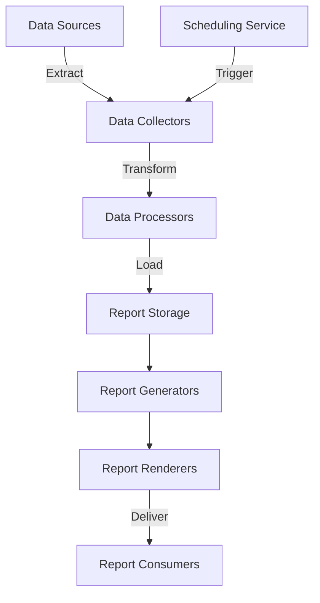

# Reporting System

The BoxFresh App includes a comprehensive reporting system that provides insights into business operations, customer trends, and service delivery metrics.

## Reporting Architecture

The reporting system follows a modular design with standardized components:



## Core Report Types

### 1. Operational Reports

Reports focusing on day-to-day operational metrics:

```apex
/**
 * Generate daily operations summary
 */
public static Daily_Operations_Report__c generateDailyOperationsSummary(Date reportDate) {
    // Extract data
    List<Assignment__c> assignments = [
        SELECT Id, Status__c, Resource_Unit__c, 
               Start_Time__c, End_Time__c, Estimated_Duration__c, Actual_Duration__c,
               Customer_Rating__c
        FROM Assignment__c
        WHERE Scheduled_Date__c = :reportDate
    ];
    
    // Process data
    Integer totalAssignments = assignments.size();
    Integer completedAssignments = 0;
    Integer cancelledAssignments = 0;
    Decimal totalEstimatedHours = 0;
    Decimal totalActualHours = 0;
    Decimal totalRating = 0;
    Integer ratingCount = 0;
    
    Map<Id, Integer> assignmentsByResource = new Map<Id, Integer>();
    
    for (Assignment__c assignment : assignments) {
        if (assignment.Status__c == 'Completed') {
            completedAssignments++;
            totalEstimatedHours += assignment.Estimated_Duration__c;
            totalActualHours += assignment.Actual_Duration__c;
            
            if (assignment.Customer_Rating__c != null) {
                totalRating += assignment.Customer_Rating__c;
                ratingCount++;
            }
        } else if (assignment.Status__c == 'Cancelled') {
            cancelledAssignments++;
        }
        
        Integer resourceCount = assignmentsByResource.containsKey(assignment.Resource_Unit__c) ?
                               assignmentsByResource.get(assignment.Resource_Unit__c) : 0;
        assignmentsByResource.put(assignment.Resource_Unit__c, resourceCount + 1);
    }
    
    // Create report
    Daily_Operations_Report__c report = new Daily_Operations_Report__c(
        Report_Date__c = reportDate,
        Total_Assignments__c = totalAssignments,
        Completed_Assignments__c = completedAssignments,
        Cancelled_Assignments__c = cancelledAssignments,
        Completion_Rate__c = totalAssignments > 0 ? 
                            (completedAssignments * 100.0 / totalAssignments) : 0,
        Total_Estimated_Hours__c = totalEstimatedHours,
        Total_Actual_Hours__c = totalActualHours,
        Efficiency_Rate__c = totalEstimatedHours > 0 ? 
                            (totalEstimatedHours / totalActualHours * 100.0) : 0,
        Average_Customer_Rating__c = ratingCount > 0 ? 
                                    totalRating / ratingCount : null,
        Resource_Count__c = assignmentsByResource.size()
    );
    
    insert report;
    
    // Store resource breakdowns
    List<Resource_Performance__c> performances = new List<Resource_Performance__c>();
    
    for (Id resourceId : assignmentsByResource.keySet()) {
        performances.add(new Resource_Performance__c(
            Operations_Report__c = report.Id,
            Resource_Unit__c = resourceId,
            Assignment_Count__c = assignmentsByResource.get(resourceId)
        ));
    }
    
    if (!performances.isEmpty()) {
        insert performances;
    }
    
    return report;
}
```

### 2. Inventory Reports

Reports tracking inventory levels, usage, and projections:

```apex
/**
 * Generate inventory utilization report
 */
public static Inventory_Report__c generateInventoryReport() {
    // Get current inventory status
    List<Inventory__c> inventories = [
        SELECT Id, Name, Capacity_Units__c, Available_Units__c, 
               (SELECT Id, Material_SKU__c, Material_SKU__r.Name, 
                       Quantity__c, Total_Value__c
                FROM Material_Stocks__r)
        FROM Inventory__c
    ];
    
    // Calculate metrics
    Integer containerCount = inventories.size();
    Decimal totalCapacity = 0;
    Decimal totalUsed = 0;
    Map<Id, Decimal> materialTotals = new Map<Id, Decimal>();
    Map<Id, Decimal> materialValues = new Map<Id, Decimal>();
    
    for (Inventory__c inventory : inventories) {
        totalCapacity += inventory.Capacity_Units__c;
        Decimal used = inventory.Capacity_Units__c - inventory.Available_Units__c;
        totalUsed += used;
        
        for (Material_Stock__c stock : inventory.Material_Stocks__r) {
            Id materialId = stock.Material_SKU__c;
            
            Decimal currentQuantity = materialTotals.containsKey(materialId) ?
                                     materialTotals.get(materialId) : 0;
            materialTotals.put(materialId, currentQuantity + stock.Quantity__c);
            
            Decimal currentValue = materialValues.containsKey(materialId) ?
                                  materialValues.get(materialId) : 0;
            materialValues.put(materialId, currentValue + stock.Total_Value__c);
        }
    }
    
    Decimal totalMaterialValue = 0;
    for (Decimal value : materialValues.values()) {
        totalMaterialValue += value;
    }
    
    // Create report
    Inventory_Report__c report = new Inventory_Report__c(
        Report_Date__c = Date.today(),
        Container_Count__c = containerCount,
        Total_Capacity__c = totalCapacity,
        Total_Used_Capacity__c = totalUsed,
        Utilization_Rate__c = totalCapacity > 0 ?
                              (totalUsed / totalCapacity * 100) : 0,
        Material_SKU_Count__c = materialTotals.size(),
        Total_Inventory_Value__c = totalMaterialValue
    );
    
    insert report;
    
    // Store material breakdowns
    List<Material_Inventory__c> materials = new List<Material_Inventory__c>();
    
    for (Id materialId : materialTotals.keySet()) {
        materials.add(new Material_Inventory__c(
            Inventory_Report__c = report.Id,
            Material_SKU__c = materialId,
            Quantity__c = materialTotals.get(materialId),
            Total_Value__c = materialValues.get(materialId)
        ));
    }
    
    if (!materials.isEmpty()) {
        insert materials;
    }
    
    return report;
}
```

### 3. Customer Reports

Reports analyzing customer relationships and service history:

```apex
/**
 * Generate customer service report
 */
public static Customer_Report__c generateCustomerReport(Id accountId) {
    // Get account information
    Account account = [
        SELECT Id, Name, Customer_Since__c, Last_Service_Date__c,
               Total_Contract_Value__c, Active_Contracts__c
        FROM Account
        WHERE Id = :accountId
    ];
    
    // Get service history
    List<Assignment__c> assignments = [
        SELECT Id, Order__r.Core_Contract__c, Scheduled_Date__c,
               Status__c, Customer_Rating__c, Feedback_Comments__c
        FROM Assignment__c
        WHERE Order__r.Core_Contract__r.Account__c = :accountId
        ORDER BY Scheduled_Date__c DESC
    ];
    
    // Calculate key metrics
    Integer totalServices = assignments.size();
    Integer completedServices = 0;
    Integer cancelledServices = 0;
    Decimal totalRating = 0;
    Integer ratingCount = 0;
    
    Map<Id, Integer> servicesByContract = new Map<Id, Integer>();
    
    for (Assignment__c assignment : assignments) {
        if (assignment.Status__c == 'Completed') {
            completedServices++;
            
            if (assignment.Customer_Rating__c != null) {
                totalRating += assignment.Customer_Rating__c;
                ratingCount++;
            }
        } else if (assignment.Status__c == 'Cancelled') {
            cancelledServices++;
        }
        
        Id contractId = assignment.Order__r.Core_Contract__c;
        Integer contractCount = servicesByContract.containsKey(contractId) ?
                               servicesByContract.get(contractId) : 0;
        servicesByContract.put(contractId, contractCount + 1);
    }
    
    // Create report
    Customer_Report__c report = new Customer_Report__c(
        Account__c = accountId,
        Report_Date__c = Date.today(),
        Customer_Since__c = account.Customer_Since__c,
        Last_Service_Date__c = account.Last_Service_Date__c,
        Total_Services__c = totalServices,
        Completed_Services__c = completedServices,
        Cancelled_Services__c = cancelledServices,
        Completion_Rate__c = totalServices > 0 ?
                            (completedServices * 100.0 / totalServices) : 0,
        Average_Rating__c = ratingCount > 0 ?
                           totalRating / ratingCount : null,
        Active_Contracts__c = account.Active_Contracts__c,
        Total_Contract_Value__c = account.Total_Contract_Value__c
    );
    
    insert report;
    
    return report;
}
```

## Report Generation Utilities

### Scheduling Reports

```apex
/**
 * Schedule a report to be generated recurring
 */
public static void scheduleRecurringReport(String reportType, String cronExpression) {
    switch (reportType) {
        case 'DailyOperations':
            System.schedule(
                'Daily Operations Report ' + System.now(),
                cronExpression,
                new DailyOperationsReportScheduler()
            );
            break;
        case 'Inventory':
            System.schedule(
                'Inventory Report ' + System.now(),
                cronExpression,
                new InventoryReportScheduler()
            );
            break;
        // Add other report types as needed
        default:
            throw new ReportingException('Unknown report type: ' + reportType);
    }
}
```

### Report Distribution

```apex
/**
 * Distribute report to specified recipients
 */
public static void distributeReport(Id reportId, String reportType, List<String> recipients) {
    // Get report data
    String reportContent = '';
    String reportSubject = '';
    
    switch (reportType) {
        case 'DailyOperations':
            Daily_Operations_Report__c report = [
                SELECT Id, Report_Date__c, Total_Assignments__c,
                       Completed_Assignments__c, Completion_Rate__c,
                       Total_Estimated_Hours__c, Total_Actual_Hours__c
                FROM Daily_Operations_Report__c
                WHERE Id = :reportId
            ];
            
            reportSubject = 'Daily Operations Report - ' + report.Report_Date__c.format();
            reportContent = generateDailyOperationsHtml(report);
            break;
        case 'Inventory':
            Inventory_Report__c invReport = [
                SELECT Id, Report_Date__c, Container_Count__c,
                       Total_Capacity__c, Total_Used_Capacity__c,
                       Utilization_Rate__c, Total_Inventory_Value__c
                FROM Inventory_Report__c
                WHERE Id = :reportId
            ];
            
            reportSubject = 'Inventory Status Report - ' + invReport.Report_Date__c.format();
            reportContent = generateInventoryReportHtml(invReport);
            break;
        // Add other report types as needed
        default:
            throw new ReportingException('Unknown report type: ' + reportType);
    }
    
    // Send email
    Messaging.SingleEmailMessage email = new Messaging.SingleEmailMessage();
    email.setSubject(reportSubject);
    email.setHtmlBody(reportContent);
    email.setToAddresses(recipients);
    
    Messaging.sendEmail(new Messaging.SingleEmailMessage[] { email });
}
```

## Helper Classes and Methods

### Report Formatters

```apex
/**
 * Generates HTML representation of a daily operations report
 */
private static String generateDailyOperationsHtml(Daily_Operations_Report__c report) {
    return '<html>' +
           '<head><style>body{font-family: Arial, sans-serif;} ' +
           'table{border-collapse: collapse;} ' +
           'th,td{border: 1px solid #ddd; padding: 8px;} ' +
           'th{background-color: #f2f2f2;}</style></head>' +
           '<body>' +
           '<h1>Daily Operations Report: ' + report.Report_Date__c.format() + '</h1>' +
           '<table>' +
           '<tr><th>Metric</th><th>Value</th></tr>' +
           '<tr><td>Total Assignments</td><td>' + report.Total_Assignments__c + '</td></tr>' +
           '<tr><td>Completed Assignments</td><td>' + report.Completed_Assignments__c + '</td></tr>' +
           '<tr><td>Completion Rate</td><td>' + report.Completion_Rate__c.setScale(2) + '%</td></tr>' +
           '<tr><td>Estimated Hours</td><td>' + report.Total_Estimated_Hours__c.setScale(2) + '</td></tr>' +
           '<tr><td>Actual Hours</td><td>' + report.Total_Actual_Hours__c.setScale(2) + '</td></tr>' +
           '</table>' +
           '</body></html>';
}
```

### Custom Exception

```apex
/**
 * Custom exception for reporting errors
 */
public class ReportingException extends Exception {
    // Custom exception for reporting errors
}
```

## Integration with Dashboards

The reporting system integrates with standard and custom dashboards through the use of custom report types and direct data access methods.

```apex
/**
 * Get data for executive dashboard
 */
public static Map<String, Object> getExecutiveDashboardData() {
    Map<String, Object> dashboardData = new Map<String, Object>();
    
    // Get recent operations reports
    List<Daily_Operations_Report__c> recentReports = [
        SELECT Report_Date__c, Completion_Rate__c, Efficiency_Rate__c,
               Average_Customer_Rating__c
        FROM Daily_Operations_Report__c
        ORDER BY Report_Date__c DESC
        LIMIT 30
    ];
    
    // Format data for charts
    List<Object> dateLabels = new List<Object>();
    List<Object> completionRates = new List<Object>();
    List<Object> efficiencyRates = new List<Object>();
    List<Object> customerRatings = new List<Object>();
    
    for (Daily_Operations_Report__c report : recentReports) {
        dateLabels.add(report.Report_Date__c.format());
        completionRates.add(report.Completion_Rate__c);
        efficiencyRates.add(report.Efficiency_Rate__c);
        customerRatings.add(report.Average_Customer_Rating__c);
    }
    
    dashboardData.put('dates', dateLabels);
    dashboardData.put('completion', completionRates);
    dashboardData.put('efficiency', efficiencyRates);
    dashboardData.put('ratings', customerRatings);
    
    // Add current inventory summary
    Inventory_Report__c latestInventory = [
        SELECT Total_Capacity__c, Total_Used_Capacity__c, Utilization_Rate__c
        FROM Inventory_Report__c
        ORDER BY Report_Date__c DESC
        LIMIT 1
    ];
    
    dashboardData.put('inventory_utilization', latestInventory.Utilization_Rate__c);
    
    return dashboardData;
}
```

## Documentation Consolidation

*This document was migrated as part of the Documentation Consolidation Initiative (April 3-11, 2025) from the original `utility_function/reporting.md` file.* 