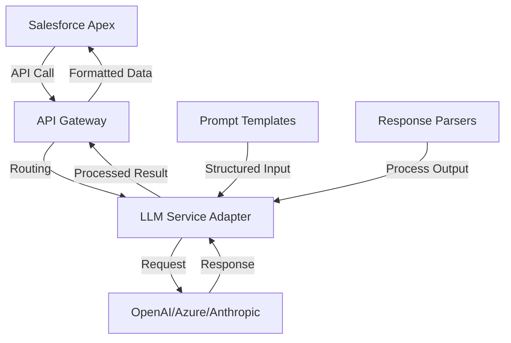

# LLM Integration

The BoxFresh App integrates Large Language Models (LLMs) to enhance various business processes through automated text generation, analysis, and decision support.

## Implementation Overview

LLM integration is designed to be modular, allowing the system to leverage AI capabilities across different business processes while maintaining separation of concerns.

### Architecture Pattern



## Core LLM Capabilities

The following utility functions provide standardized access to LLM capabilities:

### 1. Service Recommendation

```apex
/**
 * Recommends appropriate services based on property characteristics and customer needs
 */
public static List<Service_Recommendation__c> recommendServices(Id propertyId) {
    // Retrieve property information
    Property__c property = [
        SELECT Id, Size__c, Lawn_Type__c, Tree_Count__c, Flower_Beds__c,
               Special_Features__c, Last_Service_Date__c,
               Account__r.Service_History__c
        FROM Property__c
        WHERE Id = :propertyId
    ];
    
    // Construct prompt with property details
    String prompt = constructServiceRecommendationPrompt(property);
    
    // Call LLM service
    LLMResponse response = callLLM(prompt, 'service_recommendation');
    
    // Parse structured output
    List<Service_Recommendation__c> recommendations = 
        parseServiceRecommendations(response.content, propertyId);
    
    return recommendations;
}

/**
 * Constructs a structured prompt for service recommendations
 */
private static String constructServiceRecommendationPrompt(Property__c property) {
    return 'Based on the following property details, recommend appropriate garden services:\n\n' +
           'Property Size: ' + property.Size__c + ' sq ft\n' +
           'Lawn Type: ' + property.Lawn_Type__c + '\n' +
           'Tree Count: ' + property.Tree_Count__c + '\n' +
           'Flower Beds: ' + property.Flower_Beds__c + '\n' +
           'Special Features: ' + property.Special_Features__c + '\n' +
           'Last Service Date: ' + property.Last_Service_Date__c + '\n\n' +
           'Service History: ' + property.Account__r.Service_History__c + '\n\n' +
           'Provide recommendations in the following YAML format:\n' +
           '```yaml\n' +
           'recommendations:\n' +
           '  - service_type: [type]\n' +
           '    priority: [high/medium/low]\n' +
           '    reason: [short explanation]\n' +
           '    frequency: [weekly/biweekly/monthly]\n' +
           '```';
}
```

### 2. Customer Communication Enhancement

```apex
/**
 * Enhances customer communication by improving text readability and personalization
 */
public static String enhanceCustomerCommunication(String originalText, Id accountId, String communicationType) {
    // Get customer preferences and history
    Account account = [
        SELECT Id, Name, PersonTitle, PersonEmail, Communication_Preference__c, 
               Recent_Interactions__c
        FROM Account
        WHERE Id = :accountId
    ];
    
    // Construct prompt
    String prompt = 'Enhance the following ' + communicationType + ' message to customer ' + 
                   account.PersonTitle + ' ' + account.Name + '.\n\n' +
                   'Customer communication preference: ' + account.Communication_Preference__c + '\n' +
                   'Recent interactions: ' + account.Recent_Interactions__c + '\n\n' +
                   'Original text:\n' + originalText + '\n\n' +
                   'Enhance this message to be more personalized, clear, and appropriate for this customer. ' +
                   'Maintain the same information but improve the tone and clarity.';
    
    // Call LLM
    LLMResponse response = callLLM(prompt, 'communication_enhancement');
    
    return response.content;
}
```

### 3. Service Issue Analysis

```apex
/**
 * Analyzes customer reports and technician notes to identify service issues
 */
public static Map<String, Object> analyzeServiceIssue(Id caseId) {
    Case serviceCase = [
        SELECT Id, Subject, Description, CreatedDate,
               Account.Name, Account.Recent_Services__c,
               Property__r.Special_Instructions__c
        FROM Case
        WHERE Id = :caseId
    ];
    
    // Get related service records
    List<Assignment__c> recentAssignments = [
        SELECT Id, Order__r.Service_Date__c, Status__c, Completion_Notes__c,
               Resource_Unit__r.Name
        FROM Assignment__c
        WHERE Order__r.Core_Contract__r.Account__c = :serviceCase.AccountId
        ORDER BY Order__r.Service_Date__c DESC
        LIMIT 3
    ];
    
    // Build context string
    String context = 'Customer: ' + serviceCase.Account.Name + '\n' +
                     'Case Subject: ' + serviceCase.Subject + '\n' +
                     'Case Description: ' + serviceCase.Description + '\n' +
                     'Property Instructions: ' + serviceCase.Property__r.Special_Instructions__c + '\n\n' +
                     'Recent Services:\n';
    
    for (Assignment__c assignment : recentAssignments) {
        context += '- Date: ' + assignment.Order__r.Service_Date__c.format() + 
                  ', Technician: ' + assignment.Resource_Unit__r.Name + 
                  ', Status: ' + assignment.Status__c + 
                  ', Notes: ' + assignment.Completion_Notes__c + '\n';
    }
    
    // Prompt for analysis
    String prompt = 'Analyze this customer service issue and provide structured output:\n\n' + 
                   context + '\n\n' +
                   'Provide analysis in this format:\n' +
                   '```yaml\n' +
                   'issue_analysis:\n' +
                   '  root_cause: [most likely cause]\n' +
                   '  severity: [high/medium/low]\n' +
                   '  recommended_actions:\n' +
                   '    - [action 1]\n' +
                   '    - [action 2]\n' +
                   '  follow_up_questions:\n' +
                   '    - [question 1]\n' +
                   '    - [question 2]\n' +
                   '```';
    
    // Call LLM
    LLMResponse response = callLLM(prompt, 'service_issue_analysis');
    
    // Parse YAML response
    return parseYamlResponse(response.content);
}
```

## Core LLM Service

The central LLM service provides a standardized interface for all LLM interactions:

```apex
/**
 * LLM Response wrapper class
 */
public class LLMResponse {
    public String content { get; set; }
    public Double completionTokens { get; set; }
    public Double promptTokens { get; set; }
    public Double totalTokens { get; set; }
    public String model { get; set; }
    public Boolean success { get; set; }
    public String errorMessage { get; set; }
}

/**
 * Main LLM calling function with monitoring and error handling
 */
public static LLMResponse callLLM(String prompt, String promptType) {
    LLMResponse response = new LLMResponse();
    
    try {
        // Log the request for monitoring
        logLLMRequest(prompt, promptType);
        
        // Get configuration based on prompt type
        LLM_Configuration__mdt config = getLLMConfiguration(promptType);
        
        // Prepare HTTP request
        HttpRequest req = new HttpRequest();
        req.setEndpoint(config.API_Endpoint__c);
        req.setMethod('POST');
        req.setHeader('Content-Type', 'application/json');
        req.setHeader('Authorization', 'Bearer ' + config.API_Key__c);
        
        // Create request body based on provider
        Map<String, Object> requestBody = new Map<String, Object>();
        
        if (config.Provider__c == 'OpenAI') {
            requestBody.put('model', config.Model_Name__c);
            requestBody.put('temperature', config.Temperature__c);
            requestBody.put('max_tokens', config.Max_Tokens__c);
            
            List<Map<String, String>> messages = new List<Map<String, String>>();
            messages.add(new Map<String, String>{
                'role' => 'system',
                'content' => config.System_Prompt__c
            });
            messages.add(new Map<String, String>{
                'role' => 'user',
                'content' => prompt
            });
            
            requestBody.put('messages', messages);
        } 
        else if (config.Provider__c == 'Anthropic') {
            requestBody.put('model', config.Model_Name__c);
            requestBody.put('temperature', config.Temperature__c);
            requestBody.put('max_tokens', config.Max_Tokens__c);
            
            requestBody.put('prompt', config.System_Prompt__c + '\n\nHuman: ' + prompt + '\n\nAssistant:');
        }
        
        req.setBody(JSON.serialize(requestBody));
        
        // Send request
        Http http = new Http();
        HttpResponse httpResponse = http.send(req);
        
        // Process response
        if (httpResponse.getStatusCode() == 200) {
            Map<String, Object> responseBody = (Map<String, Object>) JSON.deserializeUntyped(httpResponse.getBody());
            
            if (config.Provider__c == 'OpenAI') {
                List<Object> choices = (List<Object>) responseBody.get('choices');
                Map<String, Object> choice = (Map<String, Object>) choices[0];
                Map<String, Object> message = (Map<String, Object>) choice.get('message');
                response.content = (String) message.get('content');
                
                Map<String, Object> usage = (Map<String, Object>) responseBody.get('usage');
                response.promptTokens = (Double) usage.get('prompt_tokens');
                response.completionTokens = (Double) usage.get('completion_tokens');
                response.totalTokens = (Double) usage.get('total_tokens');
            } 
            else if (config.Provider__c == 'Anthropic') {
                response.content = (String) responseBody.get('completion');
            }
            
            response.model = config.Model_Name__c;
            response.success = true;
            
            // Log successful completion
            logLLMResponse(response, promptType);
        } 
        else {
            response.success = false;
            response.errorMessage = 'HTTP Error: ' + httpResponse.getStatusCode() + ' ' + httpResponse.getStatus();
            logLLMError(response.errorMessage, promptType);
        }
    } 
    catch (Exception e) {
        response.success = false;
        response.errorMessage = 'Exception: ' + e.getMessage();
        logLLMError(response.errorMessage, promptType);
    }
    
    return response;
}
```

## LLM Configuration

LLM settings are stored in custom metadata for easy configuration:

```apex
/**
 * Get LLM configuration from custom metadata
 */
private static LLM_Configuration__mdt getLLMConfiguration(String promptType) {
    return [
        SELECT Id, DeveloperName, Provider__c, Model_Name__c, 
               API_Endpoint__c, API_Key__c, System_Prompt__c,
               Temperature__c, Max_Tokens__c, Top_P__c
        FROM LLM_Configuration__mdt
        WHERE DeveloperName = :promptType
        LIMIT 1
    ];
}
```

Sample configuration in Custom Metadata:

| DeveloperName | Provider | Model_Name | Temperature | Max_Tokens | System_Prompt |
|---------------|----------|------------|-------------|------------|---------------|
| service_recommendation | OpenAI | gpt-4 | 0.3 | 1000 | You are a gardening expert assistant for BoxFresh Gardens helping make service recommendations. |
| communication_enhancement | OpenAI | gpt-3.5-turbo | 0.7 | 1500 | You are a customer communication specialist who enhances messages for clarity and personalization. |
| service_issue_analysis | Anthropic | claude-2 | 0.2 | 2000 | You are a service quality analyst who identifies root causes of customer service issues. |

## Monitoring and Logging

All LLM interactions are logged for monitoring, debugging and compliance:

```apex
/**
 * Log LLM request for monitoring
 */
private static void logLLMRequest(String prompt, String promptType) {
    LLM_Log__c log = new LLM_Log__c(
        Prompt_Text__c = prompt,
        Prompt_Type__c = promptType,
        Request_Time__c = Datetime.now(),
        Status__c = 'Requested'
    );
    
    insert log;
}

/**
 * Log successful LLM response
 */
private static void logLLMResponse(LLMResponse response, String promptType) {
    LLM_Log__c log = [
        SELECT Id, Status__c, Response_Time__c, Response_Text__c, Token_Count__c
        FROM LLM_Log__c
        WHERE Prompt_Type__c = :promptType
        AND Status__c = 'Requested'
        ORDER BY Request_Time__c DESC
        LIMIT 1
    ];
    
    log.Status__c = 'Completed';
    log.Response_Time__c = Datetime.now();
    log.Response_Text__c = response.content;
    log.Token_Count__c = response.totalTokens;
    log.Model_Used__c = response.model;
    
    update log;
}

/**
 * Log LLM error
 */
private static void logLLMError(String errorMessage, String promptType) {
    LLM_Log__c log = [
        SELECT Id, Status__c, Response_Time__c, Error_Message__c
        FROM LLM_Log__c
        WHERE Prompt_Type__c = :promptType
        AND Status__c = 'Requested'
        ORDER BY Request_Time__c DESC
        LIMIT 1
    ];
    
    log.Status__c = 'Error';
    log.Response_Time__c = Datetime.now();
    log.Error_Message__c = errorMessage;
    
    update log;
}
```

## Response Parsing

Helper methods to parse structured LLM responses:

```apex
/**
 * Parse YAML response from LLM
 */
private static Map<String, Object> parseYamlResponse(String response) {
    // Extract YAML content between ```yaml and ``` markers
    String yamlPattern = '```yaml\\s*([\\s\\S]*?)```';
    Pattern p = Pattern.compile(yamlPattern);
    Matcher m = p.matcher(response);
    
    if (m.find()) {
        String yamlContent = m.group(1);
        // Process YAML content (simplified for illustration)
        return processYamlContent(yamlContent);
    }
    
    return new Map<String, Object>();
}

/**
 * Parse service recommendations from LLM response
 */
private static List<Service_Recommendation__c> parseServiceRecommendations(
    String response, Id propertyId
) {
    Map<String, Object> parsedResponse = parseYamlResponse(response);
    List<Service_Recommendation__c> recommendations = new List<Service_Recommendation__c>();
    
    if (parsedResponse.containsKey('recommendations')) {
        List<Object> recList = (List<Object>) parsedResponse.get('recommendations');
        
        for (Object rec : recList) {
            Map<String, Object> recMap = (Map<String, Object>) rec;
            
            Service_Recommendation__c newRec = new Service_Recommendation__c(
                Property__c = propertyId,
                Service_Type__c = (String) recMap.get('service_type'),
                Priority__c = (String) recMap.get('priority'),
                Reason__c = (String) recMap.get('reason'),
                Recommended_Frequency__c = (String) recMap.get('frequency'),
                Status__c = 'New',
                Generated_Date__c = Date.today()
            );
            
            recommendations.add(newRec);
        }
    }
    
    return recommendations;
}
```

## Benefits of LLM Integration

1. **Enhanced Customer Experience**: Personalized communications improve customer satisfaction
2. **Operational Efficiency**: Automated recommendations reduce manual analysis time
3. **Knowledge Augmentation**: LLMs supplement staff expertise with broad gardening knowledge
4. **Scalable Analysis**: Process large volumes of customer feedback and service issues
5. **Continuous Improvement**: Identify patterns and opportunities across large datasets 