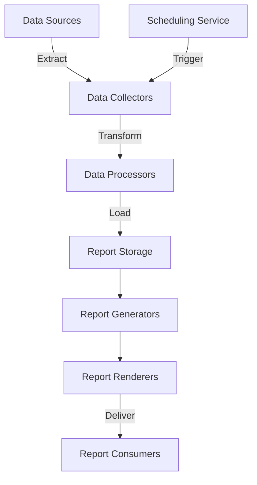

# Reporting System

The BoxFresh App includes a comprehensive reporting system that provides insights into business operations, customer trends, and service delivery metrics.

## Reporting Architecture

The reporting system follows a modular design with standardized components:



## Core Report Types

### 1. Operational Reports

Reports focusing on day-to-day operational metrics:

```apex
/**
 * Generate daily operations summary
 */
public static Map<String, Object> generateDailyOperationsSummary(Date reportDate) {
    Map<String, Object> report = new Map<String, Object>();
    
    // Get assignments for the day
    List<Assignment__c> assignments = [
        SELECT Id, Status__c, Resource_Unit__r.Name, 
               Start_Time__c, End_Time__c, Order__r.Service_Type__c
        FROM Assignment__c
        WHERE Service_Date__c = :reportDate
    ];
    
    // Calculate key metrics
    Integer totalAssignments = assignments.size();
    Integer completedAssignments = 0;
    Integer cancelledAssignments = 0;
    Integer scheduledAssignments = 0;
    Integer inProgressAssignments = 0;
    
    // Service type distribution
    Map<String, Integer> serviceTypeCount = new Map<String, Integer>();
    
    // Technician assignment count
    Map<String, Integer> technicianAssignmentCount = new Map<String, Integer>();
    
    for (Assignment__c assignment : assignments) {
        // Count by status
        if (assignment.Status__c == 'Completed') {
            completedAssignments++;
        } else if (assignment.Status__c == 'Cancelled') {
            cancelledAssignments++;
        } else if (assignment.Status__c == 'Scheduled') {
            scheduledAssignments++;
        } else if (assignment.Status__c == 'In Progress' || 
                   assignment.Status__c == 'En Route' || 
                   assignment.Status__c == 'On Site') {
            inProgressAssignments++;
        }
        
        // Count by service type
        String serviceType = assignment.Order__r.Service_Type__c;
        if (serviceTypeCount.containsKey(serviceType)) {
            serviceTypeCount.put(serviceType, serviceTypeCount.get(serviceType) + 1);
        } else {
            serviceTypeCount.put(serviceType, 1);
        }
        
        // Count by technician
        String techName = assignment.Resource_Unit__r.Name;
        if (technicianAssignmentCount.containsKey(techName)) {
            technicianAssignmentCount.put(techName, 
                                          technicianAssignmentCount.get(techName) + 1);
        } else {
            technicianAssignmentCount.put(techName, 1);
        }
    }
    
    // Revenue calculations
    AggregateResult[] revenueResults = [
        SELECT SUM(Total_Amount__c) totalRevenue
        FROM Order__c
        WHERE Service_Date__c = :reportDate
        AND Status__c = 'Completed'
    ];
    
    Decimal totalRevenue = (Decimal)revenueResults[0].get('totalRevenue');
    if (totalRevenue == null) totalRevenue = 0;
    
    // Material usage
    AggregateResult[] materialResults = [
        SELECT Inventory_Item__r.Name itemName, 
               SUM(Quantity__c) totalQuantity
        FROM Material_Usage__c
        WHERE Assignment__r.Service_Date__c = :reportDate
        GROUP BY Inventory_Item__r.Name
    ];
    
    Map<String, Decimal> materialUsage = new Map<String, Decimal>();
    for (AggregateResult ar : materialResults) {
        materialUsage.put((String)ar.get('itemName'), 
                          (Decimal)ar.get('totalQuantity'));
    }
    
    // Build report data
    report.put('reportDate', reportDate);
    report.put('totalAssignments', totalAssignments);
    report.put('completedAssignments', completedAssignments);
    report.put('cancelledAssignments', cancelledAssignments);
    report.put('scheduledAssignments', scheduledAssignments);
    report.put('inProgressAssignments', inProgressAssignments);
    report.put('completionRate', totalAssignments > 0 ? 
               (Decimal)completedAssignments / totalAssignments * 100 : 0);
    report.put('serviceTypeDistribution', serviceTypeCount);
    report.put('technicianAssignments', technicianAssignmentCount);
    report.put('totalRevenue', totalRevenue);
    report.put('materialUsage', materialUsage);
    
    // Store report data
    Report__c reportRecord = new Report__c(
        Report_Type__c = 'Daily Operations',
        Report_Date__c = reportDate,
        Report_Data__c = JSON.serialize(report),
        Status__c = 'Generated'
    );
    
    insert reportRecord;
    
    return report;
}
```

### 2. Financial Reports

Reports focused on revenue, costs, and profitability:

```apex
/**
 * Generate monthly financial summary
 */
public static Map<String, Object> generateMonthlyFinancialSummary(Integer year, Integer month) {
    Map<String, Object> report = new Map<String, Object>();
    
    // Calculate date range
    Date startDate = Date.newInstance(year, month, 1);
    Date endDate = startDate.addMonths(1).addDays(-1);
    
    // Revenue by service type
    AggregateResult[] revenueByService = [
        SELECT Service_Type__c serviceType, SUM(Total_Amount__c) revenue
        FROM Order__c
        WHERE Service_Date__c >= :startDate
        AND Service_Date__c <= :endDate
        AND Status__c = 'Completed'
        GROUP BY Service_Type__c
    ];
    
    Map<String, Decimal> revenueByServiceType = new Map<String, Decimal>();
    Decimal totalRevenue = 0;
    
    for (AggregateResult ar : revenueByService) {
        String serviceType = (String)ar.get('serviceType');
        Decimal revenue = (Decimal)ar.get('revenue');
        revenueByServiceType.put(serviceType, revenue);
        totalRevenue += revenue;
    }
    
    // Material costs
    AggregateResult[] materialCosts = [
        SELECT SUM(Total_Cost__c) materialCost
        FROM Material_Usage__c
        WHERE Assignment__r.Service_Date__c >= :startDate
        AND Assignment__r.Service_Date__c <= :endDate
    ];
    
    Decimal totalMaterialCost = (Decimal)materialCosts[0].get('materialCost');
    if (totalMaterialCost == null) totalMaterialCost = 0;
    
    // Labor costs
    AggregateResult[] laborCosts = [
        SELECT SUM(Resource_Unit__r.Hourly_Rate__c * 
                  (HOUR(End_Time__c) - HOUR(Start_Time__c))) laborCost
        FROM Assignment__c
        WHERE Service_Date__c >= :startDate
        AND Service_Date__c <= :endDate
        AND Status__c = 'Completed'
    ];
    
    Decimal totalLaborCost = (Decimal)laborCosts[0].get('laborCost');
    if (totalLaborCost == null) totalLaborCost = 0;
    
    // Customer acquisition
    AggregateResult[] newContracts = [
        SELECT COUNT(Id) contractCount, SUM(Annual_Value__c) contractValue
        FROM Core_Contract__c
        WHERE Effective_Date__c >= :startDate
        AND Effective_Date__c <= :endDate
    ];
    
    Integer newContractCount = Integer.valueOf(newContracts[0].get('contractCount'));
    Decimal newContractValue = (Decimal)newContracts[0].get('contractValue');
    if (newContractValue == null) newContractValue = 0;
    
    // Build report data
    report.put('year', year);
    report.put('month', month);
    report.put('startDate', startDate);
    report.put('endDate', endDate);
    report.put('totalRevenue', totalRevenue);
    report.put('revenueByServiceType', revenueByServiceType);
    report.put('totalMaterialCost', totalMaterialCost);
    report.put('totalLaborCost', totalLaborCost);
    report.put('grossProfit', totalRevenue - totalMaterialCost - totalLaborCost);
    report.put('grossMargin', totalRevenue > 0 ? 
              (totalRevenue - totalMaterialCost - totalLaborCost) / totalRevenue * 100 : 0);
    report.put('newContractCount', newContractCount);
    report.put('newContractValue', newContractValue);
    
    // Store report
    Report__c reportRecord = new Report__c(
        Report_Type__c = 'Monthly Financial',
        Report_Month__c = month,
        Report_Year__c = year,
        Report_Data__c = JSON.serialize(report),
        Status__c = 'Generated'
    );
    
    insert reportRecord;
    
    return report;
}
```

### 3. Customer Reports

Reports on customer satisfaction, retention, and demographics:

```apex
/**
 * Generate quarterly customer analysis
 */
public static Map<String, Object> generateQuarterlyCustomerAnalysis(Integer year, Integer quarter) {
    Map<String, Object> report = new Map<String, Object>();
    
    // Calculate date range
    Integer startMonth = ((quarter - 1) * 3) + 1;
    Date startDate = Date.newInstance(year, startMonth, 1);
    Date endDate = startDate.addMonths(3).addDays(-1);
    
    // Customer satisfaction metrics
    AggregateResult[] satisfactionResults = [
        SELECT AVG(Rating__c) avgRating, MIN(Rating__c) minRating, 
               MAX(Rating__c) maxRating, COUNT(Id) ratingCount
        FROM Customer_Feedback__c
        WHERE Feedback_Date__c >= :startDate
        AND Feedback_Date__c <= :endDate
    ];
    
    Decimal avgRating = (Decimal)satisfactionResults[0].get('avgRating');
    Decimal minRating = (Decimal)satisfactionResults[0].get('minRating');
    Decimal maxRating = (Decimal)satisfactionResults[0].get('maxRating');
    Integer ratingCount = Integer.valueOf(satisfactionResults[0].get('ratingCount'));
    
    // Customer retention
    AggregateResult[] retentionResults = [
        SELECT COUNT(Id) renewalCount
        FROM Core_Contract__c
        WHERE Renewal_Date__c >= :startDate
        AND Renewal_Date__c <= :endDate
        AND Status__c = 'Renewed'
    ];
    
    AggregateResult[] expirationResults = [
        SELECT COUNT(Id) expirationCount
        FROM Core_Contract__c
        WHERE End_Date__c >= :startDate
        AND End_Date__c <= :endDate
        AND Status__c != 'Renewed'
    ];
    
    Integer renewalCount = Integer.valueOf(retentionResults[0].get('renewalCount'));
    Integer expirationCount = Integer.valueOf(expirationResults[0].get('expirationCount'));
    Decimal retentionRate = (renewalCount + expirationCount) > 0 ? 
                          (Decimal)renewalCount / (renewalCount + expirationCount) * 100 : 0;
    
    // Service usage by customer tier
    AggregateResult[] serviceByTier = [
        SELECT Account__r.Customer_Tier__c customerTier, 
               COUNT(Id) orderCount, 
               SUM(Total_Amount__c) orderValue
        FROM Order__c
        WHERE Service_Date__c >= :startDate
        AND Service_Date__c <= :endDate
        GROUP BY Account__r.Customer_Tier__c
    ];
    
    Map<String, Map<String, Object>> tierData = new Map<String, Map<String, Object>>();
    
    for (AggregateResult ar : serviceByTier) {
        String tier = (String)ar.get('customerTier');
        Integer count = Integer.valueOf(ar.get('orderCount'));
        Decimal value = (Decimal)ar.get('orderValue');
        
        Map<String, Object> tierMetrics = new Map<String, Object>();
        tierMetrics.put('orderCount', count);
        tierMetrics.put('orderValue', value);
        
        tierData.put(tier, tierMetrics);
    }
    
    // Customer Growth
    AggregateResult[] newCustomerResults = [
        SELECT COUNT(Id) newCount
        FROM Account
        WHERE CreatedDate >= :startDate
        AND CreatedDate <= :endDate
    ];
    
    Integer newCustomerCount = Integer.valueOf(newCustomerResults[0].get('newCount'));
    
    // Build report data
    report.put('year', year);
    report.put('quarter', quarter);
    report.put('startDate', startDate);
    report.put('endDate', endDate);
    report.put('customerSatisfaction', new Map<String, Object>{
        'averageRating' => avgRating,
        'minimumRating' => minRating,
        'maximumRating' => maxRating,
        'ratingCount' => ratingCount
    });
    report.put('customerRetention', new Map<String, Object>{
        'renewalCount' => renewalCount,
        'expirationCount' => expirationCount,
        'retentionRate' => retentionRate
    });
    report.put('serviceByCustomerTier', tierData);
    report.put('newCustomerCount', newCustomerCount);
    
    // Store report
    Report__c reportRecord = new Report__c(
        Report_Type__c = 'Quarterly Customer Analysis',
        Report_Quarter__c = quarter,
        Report_Year__c = year,
        Report_Data__c = JSON.serialize(report),
        Status__c = 'Generated'
    );
    
    insert reportRecord;
    
    return report;
}
```

## Report Scheduling

The report scheduling system automates report generation:

```apex
/**
 * Schedule daily reports
 */
public class DailyReportScheduler implements Schedulable {
    public void execute(SchedulableContext sc) {
        // Generate yesterday's operational report
        Date yesterday = Date.today().addDays(-1);
        generateDailyOperationsSummary(yesterday);
    }
}

/**
 * Schedule monthly reports
 */
public class MonthlyReportScheduler implements Schedulable {
    public void execute(SchedulableContext sc) {
        // First day of current month
        Date today = Date.today();
        // Generate for previous month
        Integer previousMonth = today.month() == 1 ? 12 : today.month() - 1;
        Integer year = today.month() == 1 ? today.year() - 1 : today.year();
        
        generateMonthlyFinancialSummary(year, previousMonth);
    }
}

/**
 * Schedule quarterly reports
 */
public class QuarterlyReportScheduler implements Schedulable {
    public void execute(SchedulableContext sc) {
        // Calculate previous quarter
        Date today = Date.today();
        Integer currentQuarter = ((today.month() - 1) / 3) + 1;
        Integer previousQuarter = currentQuarter == 1 ? 4 : currentQuarter - 1;
        Integer year = currentQuarter == 1 ? today.year() - 1 : today.year();
        
        generateQuarterlyCustomerAnalysis(year, previousQuarter);
    }
}

/**
 * Setup all report schedules
 */
public static void setupReportSchedules() {
    // Schedule daily report - runs at 1 AM every day
    String dailyCron = '0 0 1 * * ?';
    System.schedule('Daily Operations Report', dailyCron, new DailyReportScheduler());
    
    // Schedule monthly report - runs on the 1st of each month at 2 AM
    String monthlyCron = '0 0 2 1 * ?';
    System.schedule('Monthly Financial Report', monthlyCron, new MonthlyReportScheduler());
    
    // Schedule quarterly report - runs on the 1st day of the first month of each quarter at 3 AM
    String q1Cron = '0 0 3 1 1 ?';
    String q2Cron = '0 0 3 1 4 ?';
    String q3Cron = '0 0 3 1 7 ?';
    String q4Cron = '0 0 3 1 10 ?';
    
    System.schedule('Q1 Customer Analysis', q1Cron, new QuarterlyReportScheduler());
    System.schedule('Q2 Customer Analysis', q2Cron, new QuarterlyReportScheduler());
    System.schedule('Q3 Customer Analysis', q3Cron, new QuarterlyReportScheduler());
    System.schedule('Q4 Customer Analysis', q4Cron, new QuarterlyReportScheduler());
}
```

## Report Delivery

Reports can be delivered through multiple channels:

```apex
/**
 * Email a report to specified recipients
 */
public static void emailReport(Id reportId, List<String> recipients) {
    Report__c report = [
        SELECT Id, Name, Report_Type__c, Report_Date__c, 
               Report_Month__c, Report_Year__c, Report_Quarter__c,
               Report_Data__c
        FROM Report__c
        WHERE Id = :reportId
    ];
    
    // Generate report title
    String reportTitle = report.Report_Type__c;
    if (report.Report_Type__c == 'Daily Operations') {
        reportTitle += ' - ' + report.Report_Date__c.format();
    } else if (report.Report_Type__c == 'Monthly Financial') {
        reportTitle += ' - ' + getMonthName(Integer.valueOf(report.Report_Month__c)) + 
                      ' ' + report.Report_Year__c;
    } else if (report.Report_Type__c == 'Quarterly Customer Analysis') {
        reportTitle += ' - Q' + report.Report_Quarter__c + ' ' + report.Report_Year__c;
    }
    
    // Parse report data
    Map<String, Object> reportData = (Map<String, Object>) JSON.deserializeUntyped(report.Report_Data__c);
    
    // Generate HTML content
    String htmlBody = '<html><head><style>' +
                     'body { font-family: Arial, sans-serif; }' +
                     'h1 { color: #2E7D32; }' +
                     'table { border-collapse: collapse; width: 100%; }' +
                     'th, td { border: 1px solid #ddd; padding: 8px; text-align: left; }' +
                     'th { background-color: #f2f2f2; }' +
                     '.metric { font-weight: bold; font-size: 16px; }' +
                     '</style></head><body>' +
                     '<h1>' + reportTitle + '</h1>';
    
    // Generate report-specific content
    if (report.Report_Type__c == 'Daily Operations') {
        htmlBody += generateDailyOperationsHtml(reportData);
    } else if (report.Report_Type__c == 'Monthly Financial') {
        htmlBody += generateMonthlyFinancialHtml(reportData);
    } else if (report.Report_Type__c == 'Quarterly Customer Analysis') {
        htmlBody += generateQuarterlyCustomerHtml(reportData);
    }
    
    htmlBody += '</body></html>';
    
    // Prepare email
    Messaging.SingleEmailMessage email = new Messaging.SingleEmailMessage();
    email.setSubject(reportTitle);
    email.setHtmlBody(htmlBody);
    email.setToAddresses(recipients);
    
    // Send email
    Messaging.sendEmail(new Messaging.SingleEmailMessage[] { email });
    
    // Update report status
    report.Status__c = 'Delivered';
    report.Delivery_Date__c = Datetime.now();
    update report;
}

/**
 * Generate daily operations HTML content
 */
private static String generateDailyOperationsHtml(Map<String, Object> reportData) {
    String html = '<h2>Summary</h2>' +
                 '<p>Total Assignments: <span class="metric">' + reportData.get('totalAssignments') + '</span></p>' +
                 '<p>Completed Assignments: <span class="metric">' + reportData.get('completedAssignments') + '</span></p>' +
                 '<p>Completion Rate: <span class="metric">' + 
                 formatDecimal((Decimal)reportData.get('completionRate')) + '%</span></p>' +
                 '<p>Total Revenue: <span class="metric">$' + 
                 formatDecimal((Decimal)reportData.get('totalRevenue')) + '</span></p>';
    
    html += '<h2>Service Type Distribution</h2><table><tr><th>Service Type</th><th>Count</th></tr>';
    Map<String, Object> serviceTypes = (Map<String, Object>)reportData.get('serviceTypeDistribution');
    for (String serviceType : serviceTypes.keySet()) {
        html += '<tr><td>' + serviceType + '</td><td>' + serviceTypes.get(serviceType) + '</td></tr>';
    }
    html += '</table>';
    
    html += '<h2>Technician Assignments</h2><table><tr><th>Technician</th><th>Assignments</th></tr>';
    Map<String, Object> techAssignments = (Map<String, Object>)reportData.get('technicianAssignments');
    for (String tech : techAssignments.keySet()) {
        html += '<tr><td>' + tech + '</td><td>' + techAssignments.get(tech) + '</td></tr>';
    }
    html += '</table>';
    
    return html;
}
```

## Dashboard Integration

Reports integrate with Salesforce dashboards:

```apex
/**
 * Refresh dashboard components with latest report data
 */
public static void updateReportingDashboards() {
    // Get dashboard IDs
    Id operationsDashboardId = [
        SELECT Id FROM Dashboard 
        WHERE DeveloperName = 'Operations_Dashboard'
        LIMIT 1
    ].Id;
    
    Id financialDashboardId = [
        SELECT Id FROM Dashboard 
        WHERE DeveloperName = 'Financial_Dashboard'
        LIMIT 1
    ].Id;
    
    Id customerDashboardId = [
        SELECT Id FROM Dashboard 
        WHERE DeveloperName = 'Customer_Dashboard'
        LIMIT 1
    ].Id;
    
    // Update recent report data
    Report__c recentDailyReport = [
        SELECT Id, Report_Data__c FROM Report__c
        WHERE Report_Type__c = 'Daily Operations'
        ORDER BY Report_Date__c DESC
        LIMIT 1
    ];
    
    Report__c recentMonthlyReport = [
        SELECT Id, Report_Data__c FROM Report__c
        WHERE Report_Type__c = 'Monthly Financial'
        ORDER BY Report_Year__c DESC, Report_Month__c DESC
        LIMIT 1
    ];
    
    Report__c recentQuarterlyReport = [
        SELECT Id, Report_Data__c FROM Report__c
        WHERE Report_Type__c = 'Quarterly Customer Analysis'
        ORDER BY Report_Year__c DESC, Report_Quarter__c DESC
        LIMIT 1
    ];
    
    // Update dashboards
    updateOperationsDashboard(operationsDashboardId, recentDailyReport);
    updateFinancialDashboard(financialDashboardId, recentMonthlyReport);
    updateCustomerDashboard(customerDashboardId, recentQuarterlyReport);
}
```

## Benefits of the Reporting System

1. **Data-Driven Decisions**: Comprehensive metrics enable evidence-based business decisions
2. **Performance Tracking**: Monitor KPIs across operations, finance, and customer satisfaction
3. **Trend Analysis**: Identify patterns and anomalies through historical data comparison
4. **Automated Delivery**: Schedule generation and distribution reduces manual effort
5. **Multi-Format Output**: View reports in-app, via email, or through dashboards 